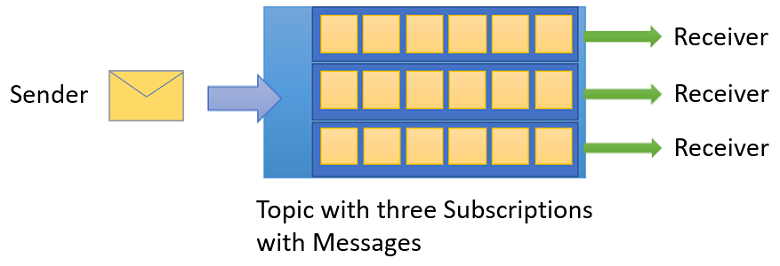
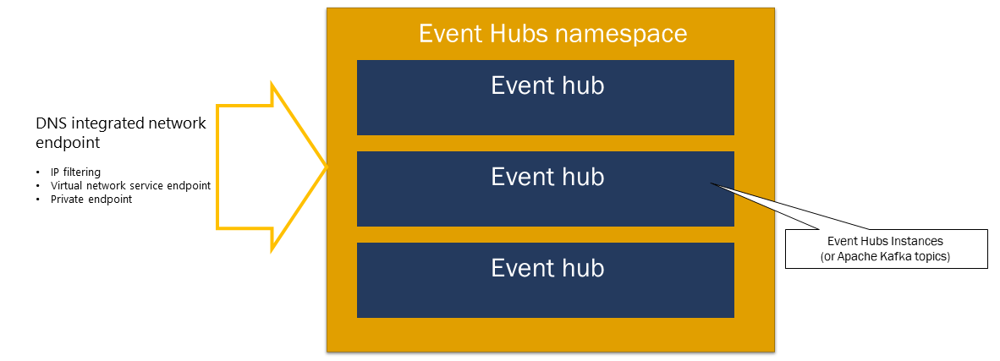
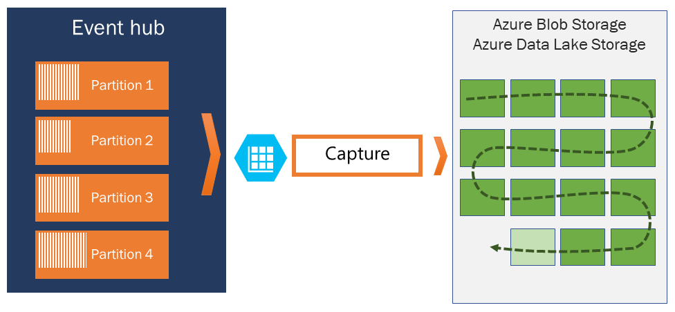

<!-- .slide: data-transition="zoom" -->
# Azure Integration Services
Charles Stacy Harris III

---

## Message and Event Patterns
- Load Leveling
- Load Balancing
- Filtering
- Partitioning
- Scheduled Delivery
- Fan Out
- etc.

note:
    <li>Load leveling smooths out intermittent spikes in workload and keeps consumers running smoothly
    <li>Load balancing distributes load among multiple consumers to improve throughput

--

note:
    <li> An [event](https://docs.microsoft.com/en-us/azure/event-grid/compare-messaging-services#event) is a lightweight notification of a condition or a state change.
    <li> A [message](https://docs.microsoft.com/en-us/azure/event-grid/compare-messaging-services#message) is raw data produced by a service to be consumed or stored elsewhere. The message contains the data that triggered the message pipeline.

--

## Storage Queues

- Part of Azure Storage
- Large storage capacity
- Message size: 64KB
- No ordering guarantee

note:
    <li> Limited only by the size of the storage account.

--

## Storage Queues

---

<!-- .slide: data-auto-animate -->
## Azure Service Bus Queues

- Push-Pull semantics
- Ordered and timestamped
- Multiple senders and multiple receivers/consumers
- Consumers compete for messages
- Delivery Guarantee: At-lease once or at-most once

note:
    <li>There can be multiple senders and multiple receivers/consumers
    <li>Consumers compete for messages
    <li>Only one consumer can consume a message
    <li>Triple redundant storage
    <li>Service Bus entities exist in a namespace

--

<!-- .slide: data-auto-animate -->
## Azure Service Bus Topics

- Push-Pull semantics
- Ordered and timestamped
- Multiple publishers and multiple subscribers
- Multiple subscribers can read the same message

note:
    <li>Subscription filters use SQL syntax
    <li>A SQL <bold>action</bold> is used to manipulate message metadata after a message has been selected by a filter of a subscription rule
    <li>Push-push via SDK

--

<!-- .slide: data-auto-animate -->
## Azure Service Bus Topics

--

### Additional Service Bus Features
- Scheduled Delivery
- Auto Forwarding
- Auto Delete
- Duplicate Detection
- Sessions
- Batching
- Ordering
- Transactions
- Poison Message Handling

--

<!-- .slide: data-auto-animate -->
## Event Hubs

note: Speaker notes
    <li> Part of service bus
    <li> Big data streaming
    <li> Event stream, clickstreams, live dashboards, etc.
    <li> AMPQ, HTTP, Apache Kafka
    <li> 1-32 partitions (Docs say min of 2, but 1 works)
    <li> Events are load balanced across partitions
    <li> Events are ordered within a partition
    <li> You can use a partition key when sending
    <li> You set up a consumer group for each application that will read from the event hub
    <li> A consumer group is a *view* into the event hub

--

## Event Hubs

<!-- .slide: data-auto-animate -->

{width="50%"}

- Push-Push processing model
- Multiple simultaneous consumers
- Consumers each read via a private cursor
- Consumers each read all of the messages

note: Speaker notes
    <li> Part of service bus
    <li> Big data streaming
    <li> Event stream, clickstreams, live dashboards, etc.
    <li> AMPQ, HTTP, Apache Kafka
    <li> 1-32 partitions (Docs say min of 2, but 1 works)
    <li> Events are load balanced across partitions
    <li> Events are ordered within a partition
    <li> You can use a partition key when sending

--

<!-- .slide: data-auto-animate -->
## Event Hub Namespaces

note:
    Speaker notes
    <li> Each hub is like a topic in Kafka
    <li> Scaling of Throughput Unit (TU), Processing Unt (PU), Compute Unit (CU) depends on pricing tier
    <li> Auto-inflate will automatically scale your TUs, etc.

--

<!-- .slide: data-auto-animate -->
## Event Publishing

note:
    <li> Partition keys can optionally be specified
    <li> Messages are ordered within a partition

--

<!-- .slide: data-auto-animate -->
## Event Hubs Partitions

note:
    <li> A partition can be thought of as a "commit log".
    <li> Partitions hold event data that contains:
        <ul>
            <li> Body of the event
            <li> User-defined property bag describing the event
            <li> Metadata such as its offset in the partition
            <li> Its number in the stream sequence
            <li> Service-side timestamp at which it was accepted
        </ul>

--

<!-- .slide: data-auto-animate -->
## Event Hubs Consumer Groups

note:
    <li> A consumer group is a **view** of the entire event hub.
    <li> You set up a consumer group for each application that will read from the event hub

--

<!-- .slide: data-auto-animate -->
## Event Hubs Checkpoint

note:
    <li>Checkpointing is a process by which readers mark or commit their position within a partition event sequence.
    <li>Checkpointing is the responsibility of the consumer and occurs on a per-partition basis within a consumer group. 

--

<!-- .slide: data-auto-animate -->
## Event Capture

note:
    <li> Data is captured to blob storage/data lake
    <li> Data is stored in Avro format

--

### Additional Information

- [Service Bus Queues vs. Storage Queues](https://docs.microsoft.com/en-us/azure/service-bus-messaging/service-bus-azure-and-service-bus-queues-compared-contrasted)
- [Service Bus Limits](https://docs.microsoft.com/en-us/azure/azure-resource-manager/management/azure-subscription-service-limits#service-bus-limits)
- [Queue Storage Limits](https://docs.microsoft.com/en-us/azure/azure-resource-manager/management/azure-subscription-service-limits#azure-queue-storage-limits)
- [Subscription and service limits, quotas, and constraints](https://docs.microsoft.com/en-us/azure/azure-resource-manager/management/azure-subscription-service-limits)
- [Scaling with Event Hubs](https://docs.microsoft.com/en-us/azure/event-hubs/event-hubs-scalability)
- [Event Hubs quotas and limits](https://docs.microsoft.com/en-us/azure/event-hubs/event-hubs-quotas)

---

## Event Grid

note:
    <li> Event Grid is an eventing backplane that enables event-driven, reactive programming. It uses the publish-subscribe model. Publishers emit events, but have no expectation about how the events are handled. Subscribers decide on which events they want to handle.
    <li> [Event Grid Sources](https://docs.microsoft.com/en-us/azure/event-grid/overview#event-sources)
    <li> [Event Handlers](https://docs.microsoft.com/en-us/azure/event-grid/overview#event-handlers)

--

<!-- .slide: data-auto-animate -->
## Event Grid

{width="50%"}

- Dynamically scalable
- Low cost
- Serverless
- At least once delivery of an event
- Available on Edge and Kubernetes

note:
    <li> Event Grid is an eventing backplane that enables event-driven, reactive programming. It uses the publish-subscribe model. Publishers emit events, but have no expectation about how the events are handled. Subscribers decide on which events they want to handle.
    <li> [Event Grid Sources](https://docs.microsoft.com/en-us/azure/event-grid/overview#event-sources)
    <li> [Event Handlers](https://docs.microsoft.com/en-us/azure/event-grid/overview#event-handlers)
    <li> Simplicity - Point and click to aim events from your Azure resource to any event handler or endpoint.
    <li> Advanced filtering - Filter on event type or event publish path to make sure event handlers only receive relevant events.
    <li> Fan-out - Subscribe several endpoints to the same event to send copies of the event to as many places as needed.
    <li> Reliability - 24-hour retry with exponential backoff to make sure events are delivered.
    <li> Pay-per-event - Pay only for the amount you use Event Grid.
    <li> High throughput - Build high-volume workloads on Event Grid.
    <li> Built-in Events - Get up and running quickly with resource-defined built-in events.
    <li> Custom Events - Use Event Grid to route, filter, and reliably deliver custom events in your app.

--

## Event Grid Terminology
- **Events** - What happened.
- **Event sources** - Where the event took place.
- **Topics** - The endpoint where publishers send events.
- **Event subscriptions** - The endpoint or built-in mechanism to route events.
- **Event handlers** - The app or service reacting to the event.

note:
    <li> Subscription endpoints sometimes route to more than one handler. Subscriptions are also used by handlers to intelligently filter incoming events.

---

# The following slides are Works in Progress

---

## Azure Functions

{width=70%}

note:
    <li> [Supported Languages](https://docs.microsoft.com/en-us/azure/azure-functions/supported-languages)
    <li> Some languages like C# and F# support both compiled libraries and script

--

## Durable Functions
- Extension of Azure Functions
- C#: Compiled class libraries and script
- JavaScript
- Python
- F#: Compiled class libraries and script
- PowerShell

note:
    <li> Lets you write stateful functions in a serverless compute environment.
    <li> Define stateful workflows by writing orchestrator functions and stateful entities by writing entity functions
    <li> The extension manages state, checkpoints, and restarts

--

## Function Chaining

note:
    <li> A sequence of functions executes in a specific order.
    <li> The output of one function is applied to the input of another function.

--

## Fan Out / Fan In

note:
    <li> A.K.A. Scatter-Gather
    <li> Execute multiple functions in parallel and then wait for all functions to finish.
    <li> Often, some aggregation work is done on the results that are returned from the functions.

--

## Async HTTP APIs

note:
    <li> Addresses the problem of coordinating the state of long-running operations with external clients.
    <li> A common way to implement this pattern is by having an HTTP endpoint trigger the long-running action. Then, redirect the client to a status endpoint that the client polls

--

## Monitor

note:
    <li> E.g., Poll until some condition is met, then trigger a function
    <li> Timer is a common trigger
    <li> Could be something more somplex than a timer
    <li> Strategies like exponential backoff are common

--

## Human Interaction / Approval

note:
    <li> Uses [**External Events**](https://docs.microsoft.com/en-us/azure/azure-functions/durable/durable-functions-external-events?tabs=csharp)
    <li> WaitForExternalEvent
    <li> Function defines the event

--

## Aggregator (Stateful Entities)

note:
    <li> Aggregate event data over a period of time
    <li> Data may come from multiple sources

---

## Logic Apps

- Connectors
- Triggers
- Actions

note:
    <li> Automated workflows in the cloud
    <li> Highly scalable
    <li> Integration via [connectors](https://docs.microsoft.com/en-us/connectors/)
    <li> The same connector model is used by the Power Platform
    <li> [About Connectors](https://docs.microsoft.com/en-us/azure/connectors/apis-list)

---

# End
